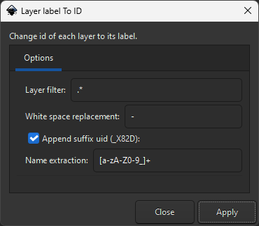

<p align="center">
    
</p>

This extension will help you to use it in other software like Cavalry, that dosn't take into account the `inkscape:label`.
It will change the id of layers in your svg document to the label name, with some extra options.

> ⚠️ **Warning: Verify you have unique inkscape label**.
> Or it is recommended to keep [use-uid](#use-uid) option instead.



<!-- omit in toc -->
# Summary
- [Prerequisites](#prerequisites)
- [Install](#install)
    - [Linux](#linux)
    - [Windows](#windows)
- [Usage](#usage)
  - [Parameters](#parameters)
      - [regex-layer](#regex-layer)
      - [space-replace](#space-replace)
      - [use-uid](#use-uid)
      - [regex-name](#regex-name)
  - [Result](#result)
- [Contribute](#contribute)
    - [Windows](#windows-1)
- [License](#license)
- [Become a supporter 🙌](#become-a-supporter-)


# Prerequisites

This extension works with **Inkscape 1.4**.

* ✔️ **Windows 11+** - Tested with the inkscape installer.
* ❓ **Windows 10+** - It needs to be tested.
* ❓ **Linux** - It needs to be tested.
* ❓ **macOS** - I do not own any Apple devices, so I cannot tell you if it will work on macOS, although I don't think there might be any compatibility issues. If you have a macOS device, please try it and let me know.

# Install
Download this project and copy the extension files (`batch_export.inx` and `batch_export.py`) to the config path of your Inkscape installation.

One simple way of finding the config path is to open Inkscape and go to **Edit > Preferences > System**. The path will be listed in the **User extensions** field. Make sure you restart Inkscape after you copied the extension files at the desired location and the extension will be available in the extensions menu.

### Linux
The default path on Linux is:
```
~/.config/inkscape/extensions
```

If you installed the flatpak version:
```
~/.var/app/org.inkscape.Inkscape/config/inkscape/extensions
```

### Windows
The path on Windows 10 is this:
```
C:\Users\[yourWindowsusername]\AppData\Roaming\inkscape\extensions
```
If you don't see the AppData folder, you need to set the windows explorer to show hidden files.

# Usage

After the extension is installed, it can be found in the **Extensions** menu, **Arrange** submenu.

## Parameters

#### regex-layer

#### space-replace

#### use-uid

#### regex-name

## Result

TODO

You can verify it with XML Editor in Inkscape, and even CTRL-Z if you want to undo it.

# Contribute

### Windows
If you want to make some modifications you can use [symlink.py](symlink.py) to make some symlinks and work with your repository.

# License
This project is licensed under the [MIT](https://github.com/StefanTraistaru/batch-export/blob/master/LICENSE.md) license.

# Become a supporter 🙌

This repositorey have help you ?

[](https://ko-fi.com/X8X6ABO4R)
