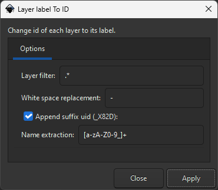

<!-- omit in toc -->
# Label To ID Inkscape Plugin

This extension will help you to use svg created with inkscape in other software like Cavalry, that dosn't take into account the `inkscape:label` field in svg file.
It will change the id of layers in your svg document to the label name, with some extra options.

> ⚠️ **Warning: Verify you have unique inkscape label**.
> Or it is recommended to keep [use-uid](#use-uid) option instead.

For extent:
```xml
<g inkscape:groupmode="layer" id="layer276" inkscape:label="Body">
```
Will be change to:
```xml
<g inkscape:groupmode="layer" id="Body_16" inkscape:label="Body">
``` 

<!-- omit in toc -->
## Summary
- [Prerequisites](#prerequisites)
- [Install](#install)
  - [Linux](#linux)
  - [Windows](#windows)
- [Usage](#usage)
  - [Parameters](#parameters)
- [Result](#result)
- [Contribute \&\& License](#contribute--license)
  - [Windows tips](#windows-tips)
- [Become a supporter 🙌](#become-a-supporter-)


## Prerequisites

This extension works with **Inkscape 1.4** on Windows 11 with the inkscape installer, and would work on most operating systems. If not please make an issue with the error associated.

## Install

Download this project and copy the extension files (`label_to_id.inx` and `label_to_id.py`) to the config path of your Inkscape installation.

One simple way of finding the config path is to open Inkscape and go to **Edit > Preferences > System**. The path will be listed in the **User extensions** field. Make sure you restart Inkscape after you copied the extension files at the desired location and the extension will be available in the extensions menu.

### Linux
The default path on Linux is:
```
~/.config/inkscape/extensions
```

If you installed the flatpak version:
```
~/.var/app/org.inkscape.Inkscape/config/inkscape/extensions
```

### Windows
The path on Windows 10 and higher is :
```
C:\Users\[yourWindowsusername]\AppData\Roaming\inkscape\extensions
```
If you don't see the AppData folder, you need to set the windows explorer to show hidden files.

## Usage

After the extension is installed, it can be found in the **Extensions** menu, **Arrange** submenu.


### Parameters



| Name                    | Command       | Description                                                                                                                                     |
| ----------------------- | ------------- | ----------------------------------------------------------------------------------------------------------------------------------------------- |
| Layer filter            | regex-layer   | Select the wanted layers that match the regular expression used.                                                                                |
| White space replacement | space-replace | Replace the white spaces with this string.                                                                                                      |
| Append suffix UID       | use-uid       | Append as suffix a generated UID. **Recommended to avoid name collision**. Deactivate it only if you know what you are doing.                   |
| Name extraction         | regex-name    | Regular expression used to extract the layer name. In the example, `[a-zA-Z0-9_]+` would extract the **last** alpha numeric name without space. |

> For testing regular expressions, you can use Test it with https://regex101.com/ to see the rules you can apply. Be careful for `Name extraction` since it would match the last match.

## Result

When applying the extension, you will at the end receive a report with the id renamed, and their total number. 
You can CTRL-Z if you want to undo it.


You can verify it by saving the document and checking the id in your favorite editor, or with `XML Editor` in Inkscape.


## Contribute && License

Feel free to modify it to suit your needs. It is a simple script that doesn't account for name colliding (outside of using a UID). If you have tested on others system than windows, feel free to submit a pull request for the code or even the documentation.

See the the [MIT](LICENSE.md) license for more.

### Windows tips

If you want to make some modifications you can use [symlink.py](symlink.py) to make some symlinks and work with your repository. You need to have python installed and in your `PATH` environment variables, and then launch it with admions privileges.

## Become a supporter 🙌

This repositorey have helped you ?

[](https://ko-fi.com/X8X6ABO4R)
